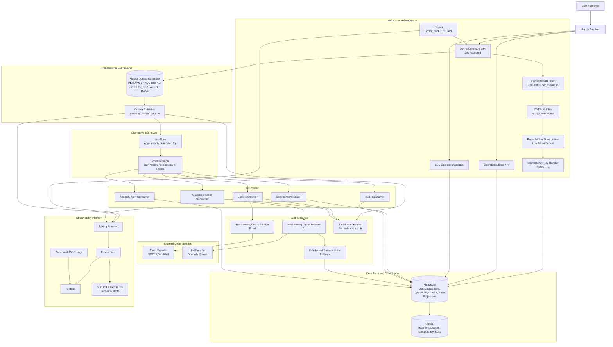
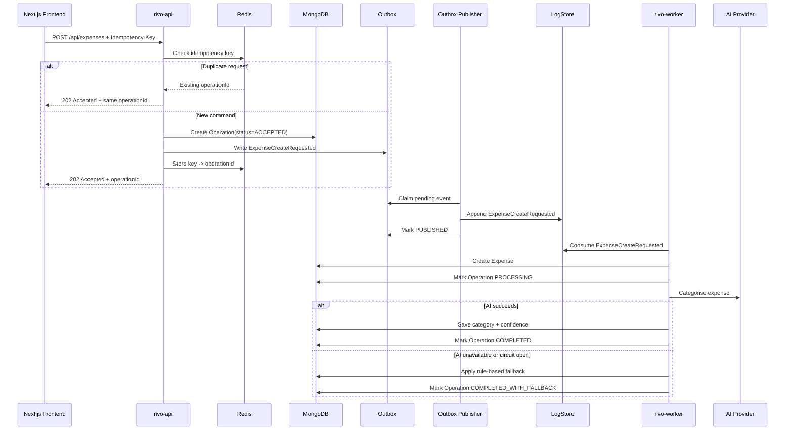
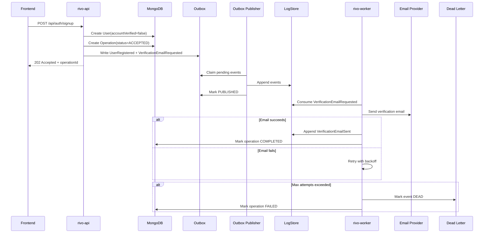

# Rivo Architecture

Rivo is being evolved from a synchronous Spring Boot expense API into a production-style, event-driven finance backend. The target design uses an asynchronous command API, a transactional outbox, LogStore as a durable distributed event log, a separate worker service for side effects, Redis for distributed coordination, and Prometheus/Grafana for observability.

The goal is not to create artificial microservice sprawl. The goal is to introduce the same reliability patterns used in real production systems: idempotency, eventual consistency, retries, dead-lettering, circuit breakers, auditability, SLOs, and operational visibility.

## Design Principles

- Keep the user-facing API fast and predictable.
- Do not call slow or unreliable external services in the critical request path.
- Persist business state and event intent atomically.
- Treat event delivery as at-least-once and make consumers idempotent.
- Preserve an immutable audit trail for finance-relevant actions.
- Prefer explicit failure states over silent loss.
- Make system health observable through metrics, logs, traces, and SLOs.
- Split services only when they have different scaling or failure characteristics.

## High-Level Architecture



## Service Boundaries

### rivo-api

The API service owns synchronous HTTP concerns:

- authenticate users
- authorize access to user-scoped resources
- validate commands
- enforce rate limits
- enforce idempotency keys
- create operation records
- write business state when the operation is intentionally synchronous
- write outbox events for asynchronous workflows
- expose operation status
- expose current read models

The API service should not send emails, call LLM providers, build monthly reports, or perform long-running anomaly detection inside the request thread.

### rivo-worker

The worker service owns asynchronous processing:

- publish outbox events to LogStore
- consume LogStore event streams
- send emails
- write audit log projections
- categorise expenses with AI
- run rule-based fallbacks when AI is unavailable
- generate anomaly alerts
- retry failed operations
- dead-letter exhausted events

This split is intentionally small. The API and worker have different latency, scaling, and failure characteristics, which makes the boundary useful without creating unnecessary distributed complexity.

### LogStore

LogStore is the durable event history:

- append-only domain event log
- historical source for audit and replay
- integration point for async consumers
- debugging timeline for user and expense workflows

MongoDB remains the source of current state. LogStore stores the historical sequence of events that explain how the system reached that state.

## Asynchronous API Model

For workflows that may involve side effects, retries, external services, or multi-step processing, Rivo should use an async command API.

### Command Submission

```http
POST /api/expenses
Authorization: Bearer <jwt>
Idempotency-Key: 747889d9-6f5f-44d7-a5f9-6aeb540efb71
Content-Type: application/json
```

```json
{
  "amount": 42.5,
  "currency": "GBP",
  "description": "Lunch near Liverpool Street",
  "paymentType": "CARD",
  "date": "2026-04-28"
}
```

Response:

```http
202 Accepted
```

```json
{
  "operationId": "op_01JZ8T4W77Y3R4S2DXH91F9RQK",
  "status": "ACCEPTED",
  "message": "Expense creation accepted"
}
```

### Operation Status

```http
GET /api/operations/op_01JZ8T4W77Y3R4S2DXH91F9RQK
```

```json
{
  "operationId": "op_01JZ8T4W77Y3R4S2DXH91F9RQK",
  "type": "CREATE_EXPENSE",
  "status": "COMPLETED_WITH_FALLBACK",
  "result": {
    "expenseId": "exp_01JZ8T5VM6GBZ8E1BRK5AQX6PV",
    "category": "Food",
    "categorisationSource": "RULE_BASED",
    "confidence": 0.64
  },
  "createdAt": "2026-04-28T13:10:11Z",
  "updatedAt": "2026-04-28T13:10:14Z"
}
```

### Operation Events

For a richer frontend experience, the API can expose Server-Sent Events:

```http
GET /api/operations/op_01JZ8T4W77Y3R4S2DXH91F9RQK/events
```

Example event stream:

```text
event: operation.accepted
data: {"operationId":"op_01JZ8T4W77Y3R4S2DXH91F9RQK"}

event: operation.processing
data: {"step":"AI_CATEGORISATION"}

event: operation.completed
data: {"expenseId":"exp_01JZ8T5VM6GBZ8E1BRK5AQX6PV"}
```

## Which APIs Should Be Async

Async:

- `POST /api/expenses`
- `PUT /api/expenses/{id}`
- `DELETE /api/expenses/{id}`
- `POST /api/auth/signup`
- `POST /api/auth/forgot-password`
- `POST /api/ai/categorise`
- `POST /api/reports/monthly`
- `POST /api/alerts/recalculate`

Synchronous:

- `POST /api/auth/login`
- `GET /api/expenses`
- `GET /api/expenses/{id}`
- `GET /api/operations/{operationId}`
- `GET /api/audit`
- `GET /api/alerts`
- health and metrics endpoints

Login stays synchronous because the client needs an immediate token. Reads stay synchronous because they query current state or projections.

## Core Data Models

### Operation

```text
Operation
- id
- userId
- type
- status: ACCEPTED | PROCESSING | COMPLETED | COMPLETED_WITH_FALLBACK | FAILED | EXPIRED
- requestHash
- idempotencyKey
- result
- errorCode
- errorMessage
- createdAt
- updatedAt
- expiresAt
```

### OutboxEvent

```text
OutboxEvent
- id
- eventId
- eventType
- aggregateType
- aggregateId
- operationId
- userId
- payload
- status: PENDING | PROCESSING | PUBLISHED | FAILED_RETRYABLE | DEAD
- attemptCount
- nextAttemptAt
- lockedBy
- lockedUntil
- lastError
- createdAt
- updatedAt
- publishedAt
```

### AuditLog

```text
AuditLog
- id
- eventId
- eventType
- actorUserId
- targetType
- targetId
- action
- before
- after
- requestId
- sourceIp
- userAgent
- occurredAt
```

## Event Types

Auth and user events:

- `UserRegistrationRequested`
- `UserRegistered`
- `UserVerified`
- `LoginSucceeded`
- `LoginFailed`
- `PasswordResetRequested`
- `PasswordResetCompleted`
- `VerificationEmailRequested`
- `VerificationEmailSent`

Expense events:

- `ExpenseCreateRequested`
- `ExpenseCreated`
- `ExpenseUpdateRequested`
- `ExpenseUpdated`
- `ExpenseDeleteRequested`
- `ExpenseDeleted`
- `ExpenseCategorisationRequested`
- `ExpenseCategorised`
- `ExpenseCategorisationFailed`

Alert events:

- `SpendingAnomalyDetected`
- `AlertGenerated`
- `AlertEmailRequested`
- `AlertEmailSent`

System events:

- `OutboxEventPublished`
- `OutboxEventFailed`
- `CircuitBreakerOpened`
- `CircuitBreakerClosed`
- `ConsumerRetryScheduled`
- `EventDeadLettered`

## Expense Creation Flow



## Registration and Email Flow



## Reliability Model

### Transactional Outbox

Business writes and event intent are stored in MongoDB in the same transaction boundary. This avoids the classic dual-write failure where business state is saved but the event is lost.

Failure example avoided:

```text
Expense saved successfully
LogStore publish failed
No audit event exists
```

Instead:

```text
Expense command accepted
Outbox event stored
Publisher retries until LogStore append succeeds or event is dead-lettered
```

### At-Least-Once Delivery

Rivo assumes events may be delivered more than once. Every consumer must be idempotent using one of:

- `eventId` uniqueness
- `operationId` uniqueness
- consumer-specific processed-event records
- natural business idempotency keys

### Dead-Lettering

Events move to `DEAD` after max retries. Dead-letter records must include:

- event payload
- failure reason
- attempt count
- last error
- consumer name
- replay eligibility

### Idempotent API Writes

Write commands require an `Idempotency-Key` header. The key maps to an operation ID in Redis for a fixed TTL. Retried requests return the same operation ID instead of creating duplicate expenses.

### Distributed Rate Limiting

Rate limiting should use Redis-backed token buckets. Redis Lua scripts provide atomic check-and-decrement behavior across multiple API instances.

### Circuit Breakers

External dependencies should be protected with Resilience4j:

- email provider
- AI provider
- LogStore client, if publishing is remote

AI fallback behavior:

```text
Circuit closed: call LLM provider
Circuit open: skip provider and use rule-based categorisation
Circuit half-open: allow limited probe requests
```

## Observability

### Metrics

API metrics:

- request count by route/status
- p50/p95/p99 latency
- auth failures
- rate-limit rejections
- idempotency hits and misses
- cache hits and misses

Outbox metrics:

- pending event count
- processing event count
- published event count
- failed retryable count
- dead-letter count
- event age
- publish latency

Worker metrics:

- events consumed by type
- consumer success/failure count
- retry count
- dead-letter count
- processing latency
- AI fallback count
- circuit breaker state

Business metrics:

- expenses created
- expenses categorised
- categorisation confidence distribution
- alerts generated
- verification emails sent

### Logs

Logs should be structured JSON and include:

- `requestId`
- `correlationId`
- `operationId`
- `eventId`
- `userId`
- `route`
- `status`
- `latencyMs`
- `consumerName`
- `errorCode`

### Dashboards

Grafana dashboards should show:

- API request rate, latency, and errors
- auth failure rate
- expense creation rate
- outbox backlog and oldest pending event age
- failed and dead-lettered events
- worker throughput
- circuit breaker state
- JVM heap, threads, and GC
- MongoDB and Redis health

## SLOs

Initial service-level objectives:

```text
Auth availability: 99.5% successful auth requests over 30 days
Expense write acceptance: 99.5% accepted commands over 30 days
Expense list latency: p95 under 200ms
Operation completion latency: p95 under 60s for normal workflows
Outbox publish latency: p95 under 30s
Dead-letter rate: below 0.1% of processed events
```

Alerting policy:

```text
Page when 50% of monthly error budget is consumed in 7 days.
Page when outbox oldest pending event age exceeds 5 minutes.
Page when dead-letter count increases over a 15-minute window.
Ticket when AI fallback rate exceeds 20% for 30 minutes.
```

## Implementation Phases

### Phase 1: Observability Foundation

- expose Actuator endpoints
- add Prometheus registry
- create Docker Compose for API, MongoDB, Redis, Prometheus, Grafana
- add structured request logging
- add correlation IDs
- create baseline Grafana dashboard

### Phase 2: Async Command Model

- add `Operation` model
- add idempotency key handling
- return `202 Accepted` for selected writes
- add operation status endpoint
- add optional SSE operation updates

### Phase 3: Transactional Outbox

- add `OutboxEvent` model
- write events during user and expense workflows
- add publisher with locking, retries, backoff, and dead-lettering
- add metrics for outbox health

### Phase 4: LogStore Integration

- publish outbox events to LogStore
- define stream names and event schema
- add LogStore health checks
- add replay documentation
- create audit projection from LogStore events

### Phase 5: Worker Service

- split `rivo-worker` from API runtime
- consume LogStore event streams
- process email, audit, AI, and alert events
- make consumers idempotent

### Phase 6: Resilience and Distributed Controls

- add Redis-backed rate limiting
- add Resilience4j circuit breakers
- add rule-based AI fallback
- add dead-letter replay tooling
- add integration tests with Testcontainers

## Interview Narrative

The concise system design explanation:

> Rivo exposes async command APIs for workflows that include side effects or external dependencies. The API validates commands, enforces rate limits and idempotency, persists operation state, and writes outbox events atomically. A worker publishes those events to LogStore, which acts as the append-only distributed event log. Independent consumers process email, audit, AI categorisation, and anomaly detection with retries, dead-lettering, and idempotent handling. Redis provides distributed coordination, Resilience4j protects external dependencies, and Prometheus/Grafana provide SLO-driven observability.

The key tradeoff:

> Rivo does not split every domain into a separate microservice. It keeps the core write model cohesive while separating asynchronous side-effect processing into a worker because that boundary has real operational value: different latency, scaling, and failure characteristics.
