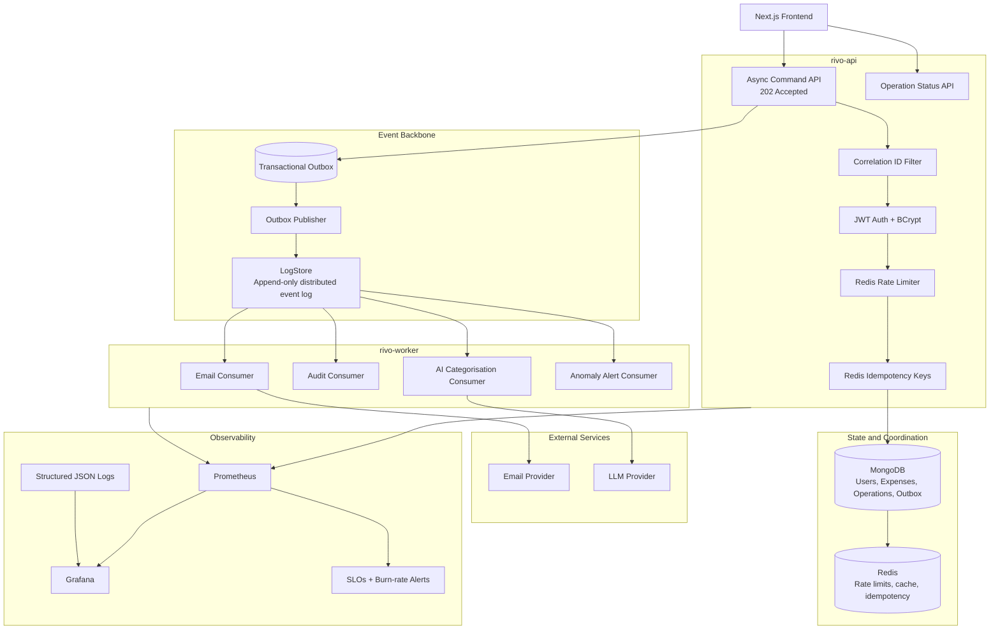

# Rivo

Rivo is a full-stack personal finance platform built around production backend engineering patterns: secure authentication, ownership-scoped expense management, asynchronous workflows, observable services, and an event-driven architecture roadmap.

The current codebase contains a Spring Boot API, MongoDB persistence, JWT authentication, email verification, password reset, Mongo-backed outbox processing for auth email side effects, correlation IDs, a Next.js client, Docker packaging, and CI/CD deployment configuration. The next architecture evolution is documented in [ARCHITECTURE.md](ARCHITECTURE.md): async command APIs, LogStore-backed event history, worker services, Redis coordination, circuit breakers, and Prometheus/Grafana observability.

## Why This Project Exists

Rivo is intentionally more than a CRUD expense tracker. The system is being shaped as a fintech-style backend where common production concerns are first-class:

- secure identity and account verification
- ownership-enforced expense operations
- async command processing for slow or failure-prone workflows
- immutable audit/event history through LogStore
- idempotency for retry-safe writes
- distributed rate limiting
- circuit breakers around external dependencies
- metrics, logs, health checks, SLOs, and alerting
- documented architectural tradeoffs

## Engineering Principles

Rivo is designed around software engineering principles that matter in production systems, not only feature delivery:

- **Domain-driven boundaries** - authentication, expenses, audit, notifications, analytics, and operations are treated as separate capabilities with clear ownership.
- **CQRS-lite** - write flows are modeled as commands that change state, while read flows query current state or derived projections such as audit logs, alerts, and future analytics views.
- **Event-driven architecture** - important business actions emit domain events so side effects like email, audit logging, AI categorisation, and anomaly detection can run asynchronously.
- **Transactional outbox** - business writes and event intent are persisted together, avoiding lost events when downstream systems fail.
- **Idempotency by design** - retryable write APIs use idempotency keys so client retries do not create duplicate expenses or duplicate side effects.
- **At-least-once delivery with idempotent consumers** - workers assume events may be delivered more than once and protect handlers with event IDs, operation IDs, or processed-event records.
- **Fail-fast at the boundary, degrade gracefully inside the system** - invalid commands are rejected early, while external provider failures use retries, circuit breakers, fallbacks, and dead-lettering.
- **Observability-first engineering** - metrics, structured logs, correlation IDs, health checks, dashboards, and SLOs are part of the architecture rather than afterthoughts.
- **Security and ownership enforcement** - every protected operation is scoped to the authenticated principal, with a future path to organisation-scoped authorization.
- **Evolutionary architecture** - the system starts as a modular monolith and introduces deployable service boundaries only where latency, scaling, or failure isolation justify it.

## Design Patterns and Architectural Concepts

Rivo's target architecture intentionally uses patterns seen in real production business systems:

| Pattern | How Rivo Uses It |
|---|---|
| CQRS-lite | Commands accept writes asynchronously; queries read current state and projections. |
| Transactional Outbox | MongoDB stores business changes and pending events in one transaction boundary. |
| Worker Service | `rivo-worker` processes email, audit, AI, and alert workflows outside the API request path. |
| Event Log | LogStore stores immutable domain events for audit, replay, and debugging. |
| Idempotency Key | Repeated client submissions return the same operation instead of duplicating writes. |
| Circuit Breaker | Resilience4j protects email and AI providers from cascading failures. |
| Retry with Backoff | Temporary failures are retried without blocking user-facing requests. |
| Dead Letter Queue | Exhausted events are preserved for inspection and manual replay. |
| Projection | Workers build read-optimized views such as audit logs, alerts, and future analytics summaries. |
| Distributed Rate Limiting | Redis-backed token buckets protect auth and write endpoints across app instances. |
| Correlation ID | Logs, metrics, operations, and events can be traced across API and worker flows. |
| SLO and Error Budget | Reliability is measured through explicit latency, availability, and event-processing targets. |

## Multi-Tenant Design Readiness

Rivo currently focuses on personal finance, but the architecture is being kept compatible with a future small-business version. That means avoiding personal-only assumptions in event names and service boundaries, and leaving a clean path to introduce:

- `Organisation` and `Membership` models
- role-based organisation access such as owner, admin, finance manager, and viewer
- organisation-scoped expenses, vendors, departments, liabilities, and analytics
- tenant-aware indexes and authorization checks
- per-tenant audit streams in LogStore
- per-tenant SLO and usage metrics

This future direction is documented as architectural readiness, not current product scope.

## Current Capabilities

- User registration with username, email, and password validation
- Email verification before login, with verification emails sent through outbox events
- Password reset using verification codes, with reset emails sent through outbox events
- JWT-based authentication
- BCrypt password hashing, including legacy plaintext password migration on login
- Authenticated expense create, update, delete, and list flows
- User-scoped expense access so users cannot mutate another user's records
- Dashboard summary API and live dashboard cards for total spend, monthly spend, category count, and transaction count
- Dashboard charts and period filters for recent expense analysis
- MongoDB persistence with indexed username and email fields
- Mongo-backed transactional outbox for auth email side effects
- Scheduled outbox poller with atomic event claiming, retries, failed-event state, and supported auth event types
- Standard API response envelope with `success`, `message`, `data`, `errorCode`, and `correlationId`
- `X-Correlation-ID` request/response header propagation and correlation-aware logs
- Structured audit logs for auth and expense mutations
- Spring Boot Actuator dependency included for operational endpoints
- Swagger/OpenAPI UI dependency included for API exploration
- Next.js frontend under `client/`
- Dockerfile for backend packaging
- GitHub Actions workflow for Azure deployment
- JUnit/Mockito tests for authentication service behavior

## Target Architecture

The intended staff-level architecture is an asynchronous, event-driven backend:



See [ARCHITECTURE.md](ARCHITECTURE.md) for the full design, async API contracts, event types, reliability model, observability plan, and implementation phases.

## Tech Stack

### Backend

- Java 17
- Spring Boot 3.4.3
- Spring Web
- Spring Security
- Spring Data MongoDB
- Spring Validation
- Spring Boot Actuator
- Spring Mail
- Spring OAuth2 Client
- Maven
- Lombok
- JJWT 0.11.5
- Springdoc OpenAPI / Swagger UI
- JUnit 5
- Mockito
- Spring Security Test

### Frontend

- Next.js 16
- React 19
- TypeScript 5
- Tailwind CSS 3
- Lucide React
- ESLint
- PostCSS / Autoprefixer

### Infrastructure

- MongoDB
- Docker
- GitHub Actions
- Azure deployment workflow

### Planned Production Libraries and Services

- Redis for distributed rate limiting, idempotency keys, and caching
- Resilience4j for circuit breakers, timeouts, retries, and fallbacks
- Micrometer Prometheus registry for metrics export
- Prometheus for metrics collection
- Grafana for dashboards
- LogStore as the append-only distributed event log
- OpenAI or Ollama for AI expense categorisation
- Testcontainers for integration tests
- Structured JSON logging with request correlation IDs

## API Surface

Current backend endpoints include:

- `POST /auth/signup` - create a user account
- `POST /auth/login` - authenticate and receive a JWT
- `POST /auth/verify` - verify a user account
- `POST /auth/resend` - resend verification code
- `POST /auth/forget` - request password reset
- `POST /auth/forget/newPassword` - complete password reset
- `POST /add` - create an expense
- `PUT /update` - update an expense
- `DELETE /remove` - delete an expense
- `GET /expenses` - list authenticated user's expenses
- `GET /expenses/summary` - summarize authenticated user's total spend, monthly spend, category count, and transaction count

Current API responses use a standard envelope:

```json
{
  "success": true,
  "message": "Operation completed",
  "data": {},
  "errorCode": null,
  "correlationId": "request-correlation-id"
}
```

Clients can pass `X-Correlation-ID`; otherwise the API generates one and returns it in the response header and body.

Implemented outbox-backed auth events:

- `USER_REGISTERED`
- `VERIFY_EMAIL_REQUESTED`
- `VERIFY_EMAIL_SENT`
- `PASSWORD_RESET_REQUESTED`
- `PASSWORD_RESET_SUCCESS`

Target async APIs:

- `POST /api/expenses` - accept expense creation command, return `202 Accepted`
- `PUT /api/expenses/{id}` - accept expense update command
- `DELETE /api/expenses/{id}` - accept expense deletion command
- `GET /api/operations/{operationId}` - check async operation status
- `GET /api/operations/{operationId}/events` - stream operation updates through SSE
- `GET /api/audit` - cursor-paginated audit view

## Reliability Roadmap

The next major backend iteration focuses on:

1. Dedicated event dispatcher/handler abstractions on top of the current outbox poller
2. Separate `rivo-worker` service for async side effects
3. LogStore integration for immutable domain events and replay
4. Redis-backed idempotency keys on write commands
5. Redis-backed distributed rate limiting
6. Resilience4j circuit breakers around email and AI providers
7. Audit log projection from domain events
8. AI categorisation with rule-based fallback
9. Prometheus metrics and Grafana dashboards
10. `SLO.md` with availability, latency, and event-processing targets

## Running Locally

Backend:

```bash
mvn clean install
mvn spring-boot:run
```

Frontend:

```bash
cd client
npm install
npm run dev
```

Required backend environment variables are documented in `src/main/resources/application-example.yml`.

## Documentation

- [ARCHITECTURE.md](ARCHITECTURE.md) - target async/event-driven architecture
- [backend.md](backend.md) - current backend feature notes
- `src/main/resources/application-example.yml` - configuration template

## Maintainer

[Saurav Jaiswal](https://github.com/sauravjaiswalsj)
